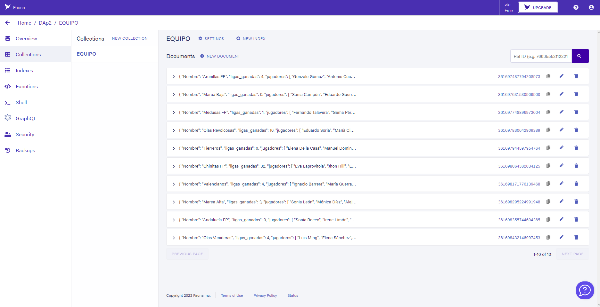
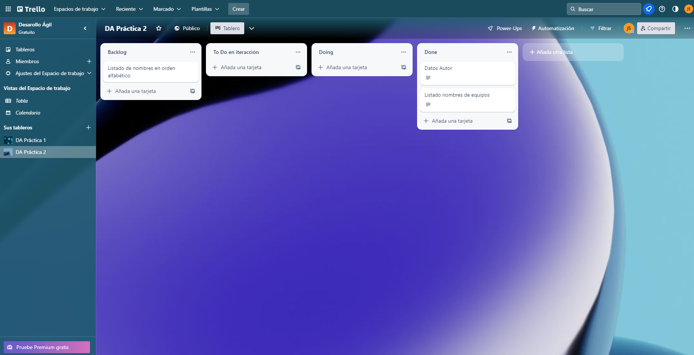

# Práctica 2

Este código que se presenta aquí corresponde a la plantilla para realizar un desarrollo basado en microservicios para las prácticas de Desarrollo Ágil, para el curso 2022-2023.

## Autor

Nombre:Juan Manuel Valcárcel Sánchez

E-mail: jmvs0006@red.ujaen.es
   
Tablero Trello: https://trello.com/b/mJqIaVog/da-práctica-2

Foto base de datos:

## Iteracción 1

En esta iteracción se ha añadido los datos de autor en la página además de mostrar el listado de los equipos en la base de datos.

