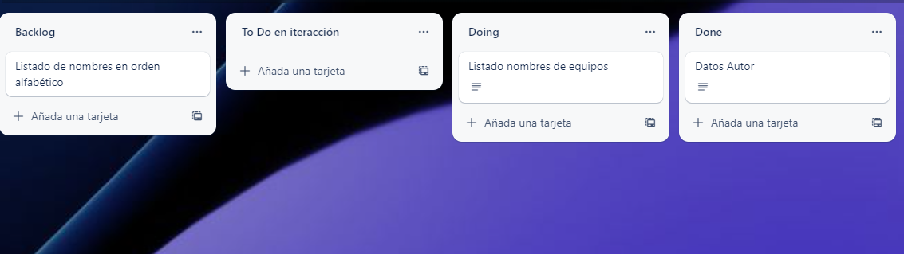

# *Práctica 2

Este código que se presenta aquí corresponde a la plantilla para realizar un desarrollo basado en microservicios para las prácticas de Desarrollo Ágil, para el curso 2022-2023.

## Autor

Nombre:Juan Manuel Valcárcel Sánchez

E-mail: jmvs0006@red.ujaen.es
   
Tablero Trello: https://trello.com/b/mJqIaVog/da-práctica-2

## Iteracción 1

Introducir nombres del autor:

